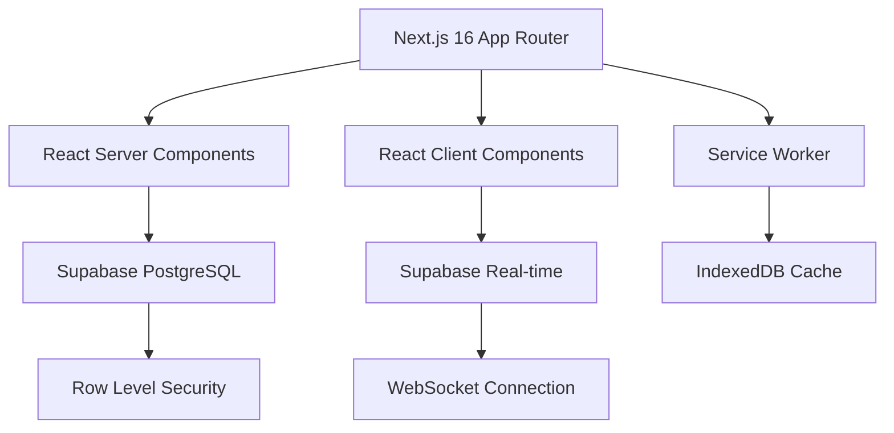

<div align="center">

# 🚀 Collector Manager

**Enterprise-grade logistics management system built with Next.js 16**

[](https://nextjs.org/)
[](https://www.typescriptlang.org/)
[](https://supabase.com/)
[](https://web.dev/progressive-web-apps/)

[Features](#-features) • [Architecture](#-architecture) • [Getting Started](#-getting-started) • [Documentation](#-documentation) • [Deployment](#-deployment)

</div>

---

## 📋 Overview

Collector Manager is a sophisticated, production-ready logistics management platform designed for modern enterprises. Built with cutting-edge web technologies, it provides a seamless experience across all devices with offline-first capabilities and real-time synchronization.

### 🎯 Core Capabilities

- **Client Management System**: Comprehensive CRM with multi-type classification, contact management, and center associations
- **Progressive Web App**: Installable on any device with offline functionality and native-like experience
- **Real-time Collaboration**: Multi-user support with role-based access control (RBAC)
- **Responsive Design**: Adaptive UI from mobile to desktop with tailored experiences
- **Type-Safe Architecture**: End-to-end TypeScript for maximum reliability and developer experience

---

## ✨ Features

### 🏢 Business Features

| Feature | Description | Status |
|---------|-------------|--------|
| **Cliente Management** | Multi-type client classification system with 7 distinct types | ✅ Production |
| **Centro Management** | Location and facility management with geolocation | ✅ Production |
| **Trabajos Module** | Job tracking and workflow management | 🚧 In Development |
| **Materiales System** | Material inventory and tracking | 🚧 In Development |
| **Authentication** | Supabase Auth with session management | ✅ Production |
| **Role-Based Access** | Admin, user, and guest permission system | ✅ Production |

### 🛠️ Technical Features

- **Progressive Web App (PWA)**
  - Installable on mobile and desktop
  - Offline functionality with service workers
  - Background sync capabilities
  - Push notifications ready

- **Modern Architecture**
  - Server Components for optimal performance
  - Client Components where interactivity is needed
  - API routes with Next.js App Router
  - Middleware-based authentication

- **State Management**
  - Custom React hooks for data fetching
  - Service layer for business logic
  - Optimistic UI updates
  - Client-side caching

- **Developer Experience**
  - TypeScript strict mode
  - ESLint + Prettier configuration
  - Auto-generated types from Supabase
  - Component-driven development

---

## 🏗️ Architecture

### Technology Stack



### Project Structure

```
collector-manager/
├── app/                          # Next.js App Router
│   ├── (auth)/                   # Authentication routes
│   │   ├── login/
│   │   └── register/
│   ├── dashboard/                # Protected dashboard
│   │   ├── clientes/             # Client management
│   │   │   └── [id]/             # Dynamic client detail
│   │   ├── centros/              # Center management
│   │   └── materiales/           # Material management
│   ├── layout.tsx                # Root layout with providers
│   └── proxy.ts                  # Auth middleware
│
├── components/                   # Reusable components
│   ├── ui/                       # shadcn/ui components
│   ├── clientes/                 # Client-specific components
│   └── layout/                   # Layout components
│
├── lib/                          # Core utilities
│   ├── constants/                # Shared constants
│   │   └── clientes.constants.ts
│   ├── services/                 # Business logic layer
│   │   └── clientes.service.ts
│   ├── utils/                    # Helper functions
│   │   └── clientes.utils.ts
│   └── supabase/                 # Supabase clients
│       ├── client.ts             # Browser client
│       ├── server.ts             # Server client
│       └── middleware.ts         # Auth middleware
│
├── hooks/                        # Custom React hooks
│   ├── useClientes.ts            # Client list management
│   └── useCliente.ts             # Single client management
│
├── types/                        # TypeScript definitions
│   └── database.ts               # Supabase generated types
│
├── public/                       # Static assets
│   ├── manifest.json             # PWA manifest
│   ├── sw.js                     # Service worker
│   └── icons/                    # PWA icons
│
└── docs/                         # Documentation
    └── PWA.md                    # PWA configuration guide
```

### Data Flow

```typescript
// Clean Architecture: Components → Hooks → Services → Supabase

// 1. Component Layer
function ClientesPage() {
  const { clientes, loading } = useClientes();
  // Renders UI
}

// 2. Hook Layer
function useClientes() {
  const service = createClientesService(supabase);
  const data = await service.getAllClientes();
  // Manages state
}

// 3. Service Layer
class ClientesService {
  async getAllClientes() {
    return await this.supabase.from('clientes').select();
    // Business logic
  }
}
```

---

## 🚀 Getting Started

### Prerequisites

- **Node.js** 18.17 or later
- **npm** 9.0 or later
- **Supabase** account and project

### Environment Setup

1. **Clone the repository**
   ```bash
   git clone <repository-url>
   cd collector-manager
   ```

2. **Install dependencies**
   ```bash
   npm install
   ```

3. **Configure environment variables**

   Create a `.env.local` file:
   ```bash
   NEXT_PUBLIC_SUPABASE_URL=your_supabase_project_url
   NEXT_PUBLIC_SUPABASE_ANON_KEY=your_supabase_anon_key
   ```

4. **Set up database**

   Run the Supabase migrations:
   ```bash
   # Initialize Supabase (if not done)
   npx supabase init

   # Link to your project
   npx supabase link --project-ref your-project-ref

   # Push database schema
   npx supabase db push
   ```

5. **Generate TypeScript types**
   ```bash
   npm run types:generate
   ```

### Development

```bash
# Start development server
npm run dev

# Open http://localhost:3000
```

### Production Build

```bash
# Create optimized production build
npm run build

# Start production server
npm start
```

---

## 📚 Documentation

### Main Guides

- **[PWA Configuration](docs/PWA.md)** - Complete PWA setup and customization
- **[Client Architecture](lib/services/README_CLIENTES.md)** - Client module architecture
- **[Quick Start PWA](QUICK_START_PWA.md)** - Fast PWA installation guide

### Module Documentation

#### Client Management
The client management system uses a layered architecture:

```typescript
// Constants Layer
import { TIPOS_CLIENTE_LABELS } from '@/lib/constants/clientes.constants';

// Utilities Layer
import { getClienteStatusClass } from '@/lib/utils/clientes.utils';

// Service Layer
const service = createClientesService(supabase);
await service.getAllClientes();

// Hook Layer
const { clientes, loading } = useClientes();
```

**Key Features:**
- Multi-type classification (remitente, destinatario, proveedor, etc.)
- Contact management with email and phone
- Center associations
- Activity status tracking
- Responsive table with progressive disclosure

#### Authentication System

Using Next.js 16's recommended proxy pattern:

```typescript
// proxy.ts - Middleware-based authentication
export async function proxy(request: NextRequest) {
  return await updateSession(request);
}

// Protects all routes except static files and auth pages
```

**Security Features:**
- Row Level Security (RLS) in Supabase
- Session-based authentication
- Automatic token refresh
- Secure cookie handling

---

## 🎨 UI/UX

### Design System

- **Framework**: [shadcn/ui](https://ui.shadcn.com/) - Radix UI + Tailwind CSS
- **Typography**: Geist Sans & Geist Mono
- **Color Scheme**: Adaptive dark/light themes
- **Icons**: Lucide React

### Responsive Breakpoints

| Breakpoint | Width | Target |
|-----------|-------|--------|
| `sm` | 640px | Mobile landscape |
| `md` | 768px | Tablets |
| `lg` | 1024px | Small laptops |
| `xl` | 1280px | Desktop |
| `2xl` | 1536px | Large displays |

### Progressive Disclosure

Tables adapt to screen size by showing/hiding columns:
- **Mobile**: Essential columns only (Nombre, Tipo, Acciones)
- **Tablet**: + CIF, Estado
- **Desktop**: + Contacto, Centros

---

## 🔐 Security

### Authentication Flow

1. User accesses protected route
2. Proxy middleware checks session
3. If invalid → Redirect to `/login`
4. If valid → Allow access + refresh token

### Database Security

- **Row Level Security (RLS)** enabled on all tables
- **Policies** based on user roles
- **API keys** never exposed to client
- **Secure session** handling with httpOnly cookies

### Best Practices

- Environment variables for secrets
- CORS configuration
- Rate limiting ready
- SQL injection prevention (Supabase client)

---

## 🧪 Testing

### Testing Strategy

```bash
# Unit tests
npm run test

# E2E tests
npm run test:e2e

# Type checking
npm run type-check

# Linting
npm run lint
```

### Code Quality

- **ESLint**: Enforces code standards
- **Prettier**: Auto-formatting
- **TypeScript**: Strict mode enabled
- **Husky**: Pre-commit hooks (optional)

---

## 📦 Deployment

### Vercel (Recommended)

```bash
# Install Vercel CLI
npm i -g vercel

# Deploy
vercel

# Production deployment
vercel --prod
```

**Environment Variables**: Add in Vercel dashboard
- `NEXT_PUBLIC_SUPABASE_URL`
- `NEXT_PUBLIC_SUPABASE_ANON_KEY`

### Docker

```dockerfile
FROM node:18-alpine AS base

WORKDIR /app
COPY package*.json ./
RUN npm ci

COPY . .
RUN npm run build

EXPOSE 3000
CMD ["npm", "start"]
```

### Custom Server

```bash
# Build for production
npm run build

# Start with PM2
pm2 start npm --name "collector-manager" -- start
```

---

## 🛣️ Roadmap

### Phase 1: Foundation ✅
- [x] Project setup with Next.js 16
- [x] Authentication system
- [x] Client management module
- [x] Center management module
- [x] PWA configuration

### Phase 2: Core Features 🚧
- [ ] Trabajos (Jobs) management
- [ ] Material tracking system
- [ ] Document upload & management
- [ ] Advanced filtering & search

### Phase 3: Advanced Features 🔮
- [ ] Real-time notifications
- [ ] Analytics dashboard
- [ ] Export/Import functionality
- [ ] Mobile app (React Native)
- [ ] API documentation

### Phase 4: Enterprise 🔮
- [ ] Multi-tenancy support
- [ ] Advanced reporting
- [ ] Integration APIs
- [ ] Audit logging

---

## 🤝 Contributing

We welcome contributions! Please follow these steps:

1. Fork the repository
2. Create a feature branch (`git checkout -b feature/amazing-feature`)
3. Commit your changes (`git commit -m 'Add amazing feature'`)
4. Push to the branch (`git push origin feature/amazing-feature`)
5. Open a Pull Request

### Development Guidelines

- Follow the existing code style
- Write meaningful commit messages
- Add tests for new features
- Update documentation
- Ensure TypeScript types are correct

---

## 📄 License

This project is proprietary software. All rights reserved.

---

## 👥 Authors

**Development Team**
- Architecture & Development
- UI/UX Design
- DevOps & Infrastructure

---

## 🙏 Acknowledgments

- [Next.js](https://nextjs.org/) - React framework
- [Supabase](https://supabase.com/) - Backend infrastructure
- [shadcn/ui](https://ui.shadcn.com/) - UI components
- [Tailwind CSS](https://tailwindcss.com/) - Styling
- [Vercel](https://vercel.com/) - Deployment platform

---

## 📞 Support

For questions, issues, or feature requests:

- 📧 Email: support@collector-manager.com
- 📝 Issues: [GitHub Issues](../../issues)
- 💬 Discussions: [GitHub Discussions](../../discussions)

---

<div align="center">

**Built with ❤️ using Next.js 16**

[⬆ Back to Top](#-collector-manager)

</div>
